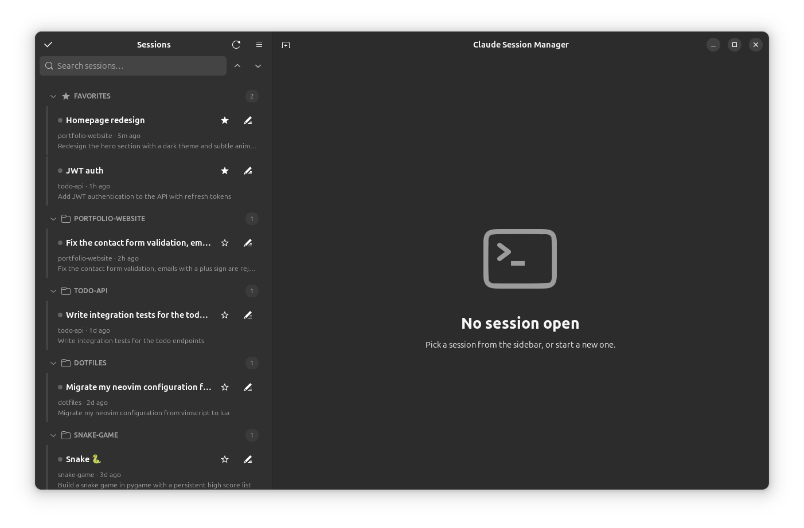

# Agent Session Manager

[](https://github.com/r4nd3l/agent-session-manager/actions/workflows/ci.yml)
[](https://pypi.org/project/agent-session-manager-gtk/)
[](https://aur.archlinux.org/packages/agent-session-manager)
[](https://github.com/r4nd3l/agent-session-manager/releases/latest)

Native GTK4/libadwaita desktop app to browse, name, and resume your AI coding-agent sessions in embedded terminal tabs. Supports [Claude Code](https://claude.com/claude-code) today, with more agents (such as Cursor) on the way.

📖 **[Documentation](https://r4nd3l.github.io/agent-session-manager/)**

> **Unofficial community tool.** An independent community project, not affiliated with or endorsed by any agent vendor (including Anthropic).
> It never modifies your agents' own session data — all app state lives in its own config file.



Features:

- **Sidebar** lists every session found on disk (for Claude Code, under `~/.claude/projects/`), grouped by project (collapsible headers, with collapse-all/expand-all buttons next to the search box), with a **Favorites** section pinned on top — star a session to move it there. A **search box** filters by name, project, preview, or session id, and the list **updates live** as sessions are created or written to.
- Sessions can be given **custom names** (pencil icon). Names, favorites, and hidden sessions persist in `~/.config/agent-session-manager/state.json` — your agents' own session files are never modified.
- **Clicking a session** opens a tab in the main area; each tab is an embedded **VTE terminal** running your `$SHELL` with the agent's resume command (`claude --resume <session-id>` for Claude Code) typed into it, in the session's original project directory. When the agent exits you drop to a shell prompt; the tab closes when the shell exits. Closing a tab asks the agent to exit cleanly (Claude Code's `/exit`) in the background first.
- **In-terminal search** with a find bar (`Ctrl+Shift+G`) over the tab's scrollback.
- **Status dots** in both the sidebar and on each open tab: green = open, blue = output arrived in a background tab. A **waiting badge** (amber ?) marks sessions where the agent's last message was a question awaiting your reply.
- **Tabs** can be renamed, given an emoji prefix, or have their session ID copied (right-click → Rename… / Set emoji… / Copy session ID); renaming a session's tab updates its name everywhere. A **close-all button** appears when more than one tab is open, and the **sidebar toggles** with the header button or `F9`. **Shift+Enter** inserts a newline in the agent's prompt.
- **Right-click a session** for the full action set: open, open in [Ghostty](https://ghostty.org) (external window — Ghostty can't be embedded), fork (`--fork-session`), rename, favorite, **details** (messages/models/tokens, a peek at recent messages, and MCP servers/usage), copy session id, reveal transcript, hide, or move the transcript to trash.
- **Desktop notifications** when a background session goes quiet after producing output — click to jump to that tab (toggle in Preferences).
- **Select mode** (checkbox button in the sidebar header) for bulk actions: open, star, hide, or trash many sessions at once.
- **New session** (tab icon in the header) asks for a project folder and starts a fresh agent session (`claude`) there.
- **Quick switcher** (`Ctrl+Shift+K`) jumps to any session by type-ahead; the **New Session** button remembers your last folder; the sidebar is **resizable** and its width is remembered.
- **MCP servers browser** (menu → MCP servers): a read-only view of every MCP server configured in `~/.claude.json`, global and per-project.
- **Preferences** (menu → Preferences, or `Ctrl+,`): terminal font, scrollback, color scheme.
- A status footer shows session, project, transcript-size, and open-tab counts.

### Keyboard shortcuts

| Shortcut | Action |
|---|---|
| `Ctrl+Shift+F` | Focus search |
| `Ctrl+Shift+T` | New session |
| `Ctrl+Shift+N` | New window |
| `Ctrl+Shift+W` | Close current tab |
| `Ctrl+PgUp` / `Ctrl+PgDn` | Previous / next tab |
| `Ctrl+Shift+C` / `Ctrl+Shift+V` | Copy / paste in terminal |
| `Ctrl+Shift+G` | Find in terminal |
| `Ctrl+Shift+K` | Quick switcher (jump to any session) |
| `F9` | Toggle sidebar |
| `Ctrl+,` | Preferences |

## Requirements

Python ≥ 3.10, GTK 4, libadwaita ≥ 1.5, VTE (GTK 4 build), PyGObject — from your distro's packages:

```bash
# Ubuntu / Debian
sudo apt install python3-gi gir1.2-gtk-4.0 gir1.2-adw-1 gir1.2-vte-3.91

# Fedora
sudo dnf install python3-gobject gtk4 libadwaita vte291-gtk4

# Arch
sudo pacman -S python-gobject gtk4 libadwaita vte4
```

Plus a supported agent's CLI on your `PATH` — currently the [`claude` CLI](https://claude.com/claude-code).

> Installing with `pipx`? PyGObject comes from the system, so use
> `pipx install --system-site-packages agent-session-manager-gtk`.

## Install

**Ubuntu — PPA:**

```bash
sudo add-apt-repository ppa:matemiller992/agent-session-manager
sudo apt update && sudo apt install agent-session-manager
```

**Arch — AUR:** `yay -S agent-session-manager`

**Any distro — pipx:** `pipx install --system-site-packages agent-session-manager-gtk`

**Debian/Ubuntu — .deb package** (from the [latest release](https://github.com/r4nd3l/agent-session-manager/releases/latest)):

```bash
sudo apt install ./agent-session-manager_0.8.0_all.deb
```

Dependencies are pulled in automatically; the app appears in your app grid as "Agent Session Manager".

**From source:**

```bash
git clone https://github.com/r4nd3l/agent-session-manager.git
cd agent-session-manager
python3 -m claude_session_manager
```

Or install the desktop launcher + icon (shows up in the app grid as "Agent Session Manager"):

```bash
./data/install.sh
```

Terminal shortcuts: `Ctrl+Shift+C` copy, `Ctrl+Shift+V` paste.

## Layout

```
claude_session_manager/
├── app.py        # Adw.Application entry point + CSS
├── window.py     # main window: split view, sidebar, tabs, actions, dialogs
├── sessions.py   # session discovery + transcript statistics
├── state.py      # persistent app state (names, favorites, hidden, settings)
├── prefs.py      # preferences dialog
└── terminal.py   # VTE terminal tab spawning the agent CLI
data/
├── io.github.r4nd3l.AgentSessionManager.desktop   # launcher template
├── icons/io.github.r4nd3l.AgentSessionManager.svg # app icon
└── install.sh                              # install launcher + icon for current user
scripts/
├── build_deb.sh                            # build the .deb package into dist/
└── make_demo_data.py                       # fake sessions for screenshots/demos
```

## Publishing (maintainers)

Releases are one step: **push a `v*` tag**. `.github/workflows/release.yml` then
builds the wheel/sdist and the `.deb`, creates the GitHub Release (with the
`.deb` attached and auto-generated notes), and publishes to
[PyPI](https://pypi.org/project/agent-session-manager-gtk/) via **trusted
publishing** (OIDC — no API tokens).

```bash
# bump version in pyproject.toml / __init__.py / debian/changelog, commit, then:
git tag -a v0.8.0 -m v0.8.0 && git push origin v0.8.0
```

PyPI trusted-publisher setup expects workflow `release.yml` (owner `r4nd3l`,
repo `agent-session-manager`). The AUR and PPA are updated separately
(see `packaging/`).

## Roadmap

- Distribution: AUR, Ubuntu PPA, Flathub
- Optional: terminal color themes, "watch a project", i18n
